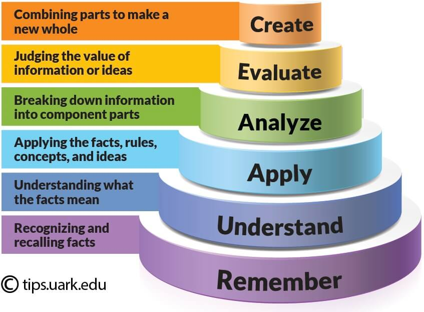
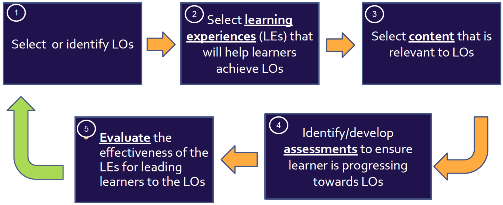

# Pedagogik och lärande {background-color="#880088" footer="false"}

 

::: {#logo}
{width="25%"}
:::

 

Kursledarprogram WCS 2025

## Lärandemål

 

Efter avslutat seminarie ska deltagaren kunna:

- Förstå vad ett lärandemål är
- Beskriva de olika stegen i Blooms taxonomi
- Förstå hur lärandemål kan användas för att planera lektioner
- Tillämpa Blooms verb och matchande läraktiviteter för att planera en lektion

## Vad är lärandemål?

 

Vad menas med att kunna grunderna i WCS?

 

::: incremental
* Lista grundturerna?
* Förstå skillnaden mellan pushes och passes?
* Utföra grundturerna?
* Analysera en tur och identifiera vilken grundtur den är byggd på?
* Skapa nya turer baserat på grundturerna?
:::

## Varför använder vi lärandemål?

 

* Beskriver vad deltagarna ska kunna efter lektionen/kursen

* Gör det lättare att planera en lektion utefter vad målet är

* Gör det lättare att utvärdera om målet är uppnått

* Gör det lättare att kommunicera med andra kursledare

## Blooms taxonomi

 

{fig-align="center"}

## Hur definierar vi bra mål i dans?

 

Istället för **“jobba med stretch”**:

::::: columns
::: {.column width="50%"}

* **Förstå**: Kan beskriva vad stretch innebär
* **Tillämpa**: Kan skapa stretch i ankarsteg
* **Analysera**: Kan identifiera var i dansen stretch saknas
* **Skapa**: Kan skapa nya turer beroende på hur stretchen varieras
:::

::: {.column width="50%"}
{fig-align="right" height=400}
:::
:::::

## Blooms verb

 

::: {.smaller}

| Komma ihåg  | Förstå       | Tillämpa   | Analysera   | Utvärdera   | Skapa      |
|-------------|--------------|------------|-------------|-------------|------------| 
| Definiera   | Förklara     | Använda    | Identifiera | Jämföra     | Kombinera  |
| Beskriva    | Utveckla     | Verkställa | Illustrera  | Förklara    | Utarbeta   |
| Lista       | Ge exempel   | Producera  | Relatera    | Motivera    | Konstruera | 
| Nämna       | Sammanfatta  | Visa       | Välja       | Sammanfatta | Organisera |
| Identifiera | Generalisera | Lösa       | Bearbeta    | Föreslå     | Modifiera  |
: {.xsmall-table}
:::

## Kursdesign

 

Hur använder vi lärandemål för att designa kurser/lektioner?

 

{fig-align="center"}

## Välja lärandeaktiviteter utefter lärandemål

 

::: {.smaller}

| Blooms | Aktivitet  | Dansaktivitet |
|--------|------------|---------------| 
| Komma ihåg | Föreläsning   | Teoretisk introduktion  |
| Förstå     | Uppsats       | Kategorisera turer      |
| Tillämpa   | Övningar      | Dansa och använda turer |
| Analysera  | Övningar      | Bryta ner turer i delar |
| Utvärdera  | Peer feedback | Utvärdera din/andras dans, ge feedback |
| Skapa      | Grupparbete   | Musikalitetsövningar, Fortsätta från en viss punkt |
: {.small-table .sm tbl-colwidths="[25,25,50]"}
:::

## Kognitiv belastning – hur mycket kan vi säga på en gång?

 

::: incremental
* Arbetsminnet är begränsat, överbelasta det inte
* Chunking: dela upp komplexa moment i tydliga smådelar
* Ge en instruktion i taget
* Undvik att undervisa figur + teknik + styling samtidigt
* Visa före du förklarar (VPIÖ)
:::

## Vad betyder det här för oss instruktörer?

 

::: fragment
**1. Planera lektioner utifrån ett huvudmål**

- Bestäm en sak som deltagarna ska kunna när lektionen är klar (**demonstrera stretch i ankarsteg**)

- Sikta på 1 huvudmål + 1 stödmål

Exempel:

*Dagens mål är att demonstrera bra stretch i ändlägen. Turen vi använder är bara verktyget*
:::

## Vad betyder det här för oss instruktörer?

 

::: fragment
**2. Välj turer efter målet (inte tvärtom)**

- Figuren är inte målet, den är bara ett träningsredskap

- Om målet är timing: välj turer som låter deltagarna fokusera på timing, inte komplicerade turer

- Om målet är musikalitet: undvik att gå alltför mycket in på teknik
:::

## Vad betyder det här för oss instruktörer?

 

::: fragment
**3. Använd Bloom för att variera nivån på en övning**

Exempel left side turn:

* **Förstå**: beskriva vad turen bygger på
* **Tillämpa**: dansa turen i takt
* **Analysera**: hitta var de tappar connection
* **Utvärdera**: ge partners feedback
* **Skapa**: göra en egen variant
:::

## Diskussion: Att använda lärandemål för att planera en lektion

 

**1. Hur kan lärandemål och kursdesign hjälpa oss planera våra WCS-lektioner?**

**2. Hur skulle ett exempel kunna se ut?**

 

Diskutera i grupper