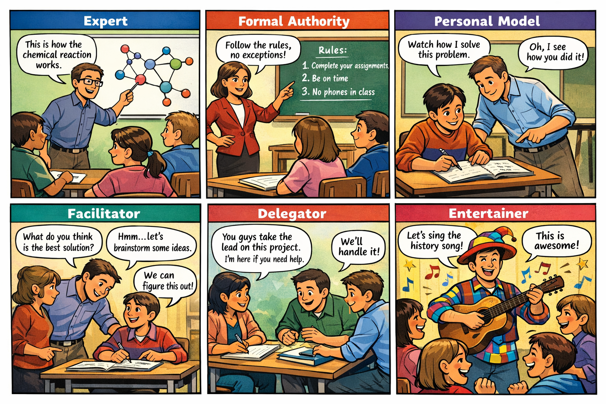

# Din utveckling som kursledare {background-color="#880088" footer="false"}

 

::: {#logo}
{width="25%"}
:::

 

Kursledarprogram WCS 2025

## Lärandemål

 

Efter avslutat seminarie ska deltagaren kunna:

- Understand the different stages of the development as a course leader
- Understand the difference between teaching styles
- Evaluate their own development as a course leader
- Evaluate their own teaching style and understand how it affects their teaching
- Understand why we do exercises like "_Reflect on ..._"

## Background reading

- Peter Kugel: _How professors develop as teachers_, 1993
- Anthony F. Grasha: _A Matter of Style: The Teacher as Expert, Formal Authority, Personal Model, Facilitator, and Delegator_, 1994

::: fragment

::: {.textbox}
George Box: "**All models are wrong, but some are useful**"
:::

:::

## What teachers focus on

 

**Phase I: Emphasis on teaching**

::: incremental
* Focus on self: "Am I doing the right thing? Am I doing it well?"
* Focus on subject: "Am I covering the material? Am I giving good explanations?"
* Focus on students: "Are the students learning? Are they engaged?"
:::

::: fragment
**Phase II: Emphasis on learning**

::: incremental
* Student as receptive: "Are the students receiving the information? Are they understanding?"
* Student as active: "Are the students applying the information? Are they analysing?"
* Student as independent: "Are the students creating new knowledge? Are they evaluating?"
:::

:::

## Focus on self

 

::: incremental
* Many of us begin as "assistants" and teach with a more experienced teacher
* When we first teach, we're in terror: "_Will I survive?_"
* We're afraid that we might not know the answer to a question
* As a student, we could hide, now we're in the spotlight
* **Problem**: We know about the dance, but not much about teaching
:::

::: fragment
#### Common problems and "solutions"

::: incremental
* Covering too much or too little material
* Don't know how to explain the material
* Don't know how to see if the students get it
* ...
* "Solution": Practice, experience, and feedback
:::

:::

## Focus on subject

 

::: incremental
* We develop a better understanding of the dance 
* We can speed up the students' learning by telling them what we figured out
* We know so much that we don't have enough time to cover everything
* We are excited about questions, they let us dig into the details
* **Problem**: sometimes we give so much information that students don't know what to do with it
* **Consequence**: students never need to figure things out for themselves
:::

::: fragment

::: {.textbox}
This is not all bad. Remember that everybody has different reasons for taking dance classes. 
:::

:::

## Focus on student / student as receptive

 

::: {.textbox}
Up until here, the focus was on **teaching**. Now we shift focus to **learning**.
:::

::: incremental
* We realise that all students are different, so we mix _telling_ and _showing_
* We mix harder and easier material, so there's something for everyone
* Questions tells us something about where students are in their learning
* We ask questions to figure out what our students understand
:::

## Focus on learning

### Student as active
::: incremental
* We need to make the students think about what we tell them
* How exactly students learn is different, some learn by *doing*, some by *watching*, some by *thinking*
* We start to see ourselves more as coaches than as experts
* **Limitation**: we still tell the students when to think and what to think about
* **Risk**: some students get annoyed when we _force_ them to think instead of _telling_ them what's right, they could feel like they don't learn anything
:::

::: fragment
### Student as independent
::: incremental
* **Idea**: we give students the tools and then let them choose what to learn
* **Consequence**: students become experts on things we know little about
:::

:::

::: fragment
::: {.textbox}
Our development as teachers is not linear. We will jump back and forth between the stages.
:::
:::

## Discussion in breakout rooms

 

**Discuss**

- Do you recognize yourself in any of the stages?
- Do you recognize your teachers in any of the stages?
- What do you think about the focus on teaching vs. learning? Is one of them more important than the other?

## Teaching styles

{fig-align="center"}

## Teaching styles

1. Expert → Experten\
Läraren fokuserar på att förmedla ämneskunskap och visa sin expertis för att utveckla studenternas kompetens.

2. Formal Authority → Formell auktoritet\
Läraren betonar regler, standarder och tydliga förväntningar kring vad som är korrekt och acceptabelt.

3. Personal Model → Personlig förebild\
Läraren undervisar genom att visa hur man tänker och arbetar, så att studenter kan observera och efterlikna. 

4. Facilitator → Handledare (eller Facilitator)\
Läraren vägleder genom frågor och stöd så att studenter utvecklar självständigt tänkande och ansvar.

5. Delegator → Delegator (eller Delegerande lärare)\
Läraren ger studenter stort ansvar att arbeta självständigt eller i team medan hen fungerar som resurs.

6. Bonus in dancing: Entertainer

## Discussion

 

**Discuss**

- Do you recognize yourself in any of the teaching styles?
- Do you recognize your teachers in any of the teaching styles?
- Do you think one of the teaching styles is better than the others? Why or why not?